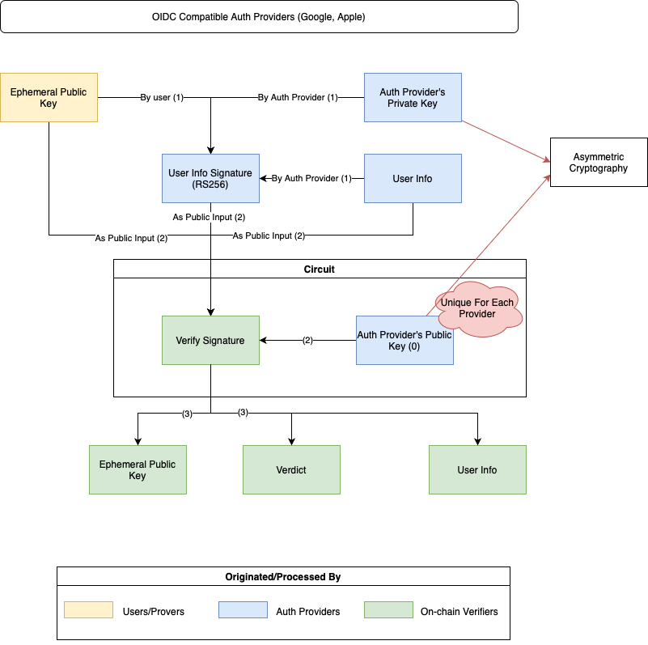
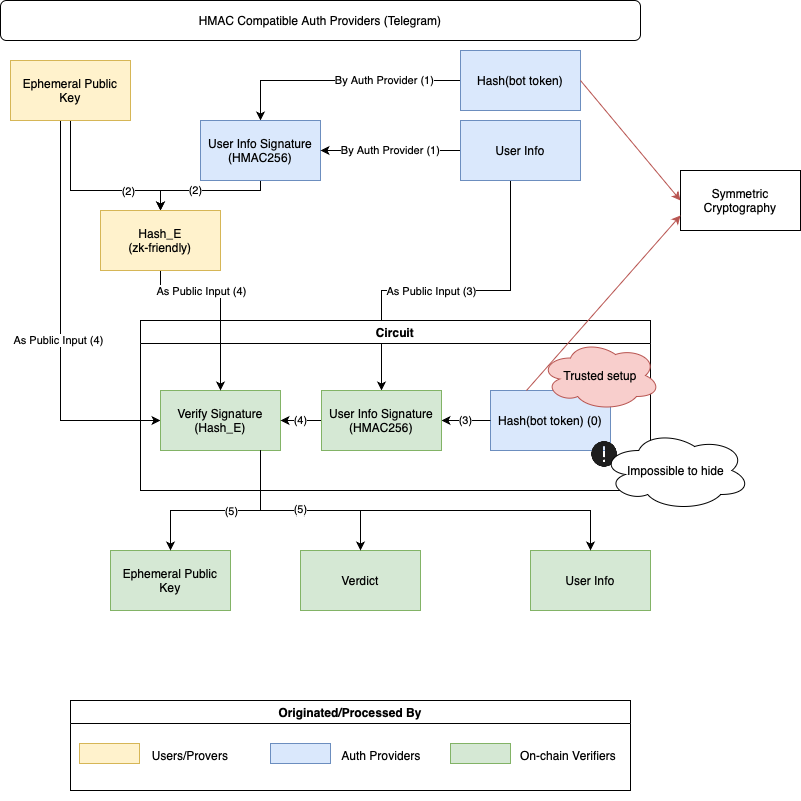

# Invisible Wallets on Telegram

## Introduction

Invisible wallets allow users to send transactions from a Web3 address using Web2 credentials, without publicly linking the two
identities.

Many Web2 credentials, such as [OAuth credentials](https://datatracker.ietf.org/doc/html/rfc6749), are supported by major providers
like Google, Apple, and Microsoft, which typically use the [RS256](https://auth0.com/docs/get-started/applications/signing-algorithms)
algorithm (an asymmetric method). There are already solutions for building invisible wallets using OAuth credentials. However, Telegram
uses a different authentication method, based on [HMAC256](hmac.md) (a symmetric algorithm), which requires a different solution.

In this document, we will first explain the existing solution for OAuth providers. Then, we will explore several approaches to address
the challenges with Telegram's authentication system. Although we have not yet developed a complete solution for Telegram, we hope this
guide will help others find one.

The following sections are organized as follows:

- Section 2: OIDC Solution
- Section 3: Telegram Auth Mechanism and Its Challenges

## OIDC Solution

For OIDC-compatible authentication providers like Google or Apple, the process for building invisible wallets follows these
steps [^1][^2]:



1. The user generates an ephemeral wallet, which will later interact with the blockchain. After authenticating with an OIDC provider (
   e.g., Google), the user requests the provider to sign a JWT token that contains the user's ephemeral public key. This JWT is signed
   using the provider's private key with the RS256 algorithm.
2. The user's information, ephemeral public key, and the provider's signature are passed into a Zero-Knowledge circuit, along with the
   provider's public key (embedded inside the circuit).
3. If the signature is valid, the smart contract links the ephemeral public key to the user's identity. This allows the user to
   interact with the blockchain through the ephemeral wallet without the need for traditional private keys.

## Telegram Auth Mechanism and Its Challenges

### Telegram Auth Mechanism [^3]

To verify the authenticity of the data received from Telegram, compare the received hash parameter with the hexadecimal representation
of the [HMAC-SHA-256](hmac.md) signature of the `data-check-string`. Use the SHA256 hash of the bot's token as the secret key.

The `data-check-string` is a concatenation of all received fields, sorted alphabetically – e.g.,
`auth_date=<auth_date>\nfirst_name=<first_name>\nid=<id>\nusername=<username>`.

Here's an example of the verification process:

```
data_check_string = ...
secret_key = SHA256(<bot_token>)
if (hex(HMAC_SHA256(data_check_string, secret_key)) == hash) {
  // Data is from Telegram
}
```

### Building Invisible Wallets for HMAC256 Providers

The process for building invisible wallets with HMAC256-compatible providers like Telegram follows these steps:



1. After authenticating with the provider (e.g., Telegram), the user requests the provider to sign their user information using the
   bot_token.
2. The user generates an ephemeral wallet for blockchain interactions. The user information signature is then hashed (using a
   zk-friendly hashing algorithm) along with the user’s ephemeral public key to create a value called Hash_E. This replaces the user
   information signature and prevents others from linking the user information signature to any arbitrary wallet.
3. Inside the Zero-Knowledge circuit, the user information and bot_token are used to securely re-compute the user information
   signature.
4. The circuit combines the ephemeral public key, the calculated user information signature, and Hash_E to verify Hash_E.
5. If Hash_E is valid, the smart contract links the ephemeral public key to the user’s identity, allowing the user to interact with the
   blockchain via the ephemeral wallet.

**Note 1**: The bot_token is a secret known only to Telegram and the app owner. This ensures that the app owner can verify the
authenticity of the signature when receiving data from Telegram. The bot_token also enables the app owner to generate valid signatures.
It is critical to prevent unauthorized access to the bot_token, as anyone with the bot_token could create fraudulent signatures.

**Note 2**: At present, there is no way to securely embed the bot_token inside the Zero-Knowledge circuit without exposing it to
others. This limitation means the bot_token cannot be fully protected within the circuit, posing a security risk if it is accessed by
unauthorized parties.

[^1]: [zkLogin](https://docs.sui.io/concepts/cryptography/zklogin)
[^2]: [Keyless Account](https://aptos.dev/en/build/guides/aptos-keyless/introduction)
[^3]: [Telegram Authorization Check](https://core.telegram.org/widgets/login#checking-authorization)
